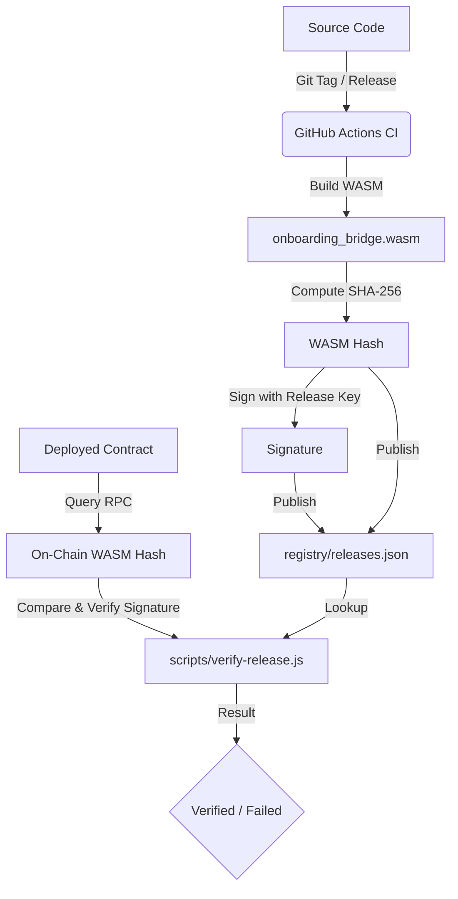

# Soroban Contract WASM Verification Guide

This repository implements a robust, reproducible build and verification system for the **C-Address Onboarding Bridge** Soroban smart contract. 

Every release is compiled in a clean CI environment, its SHA-256 hash is computed, signed by the release authority, and published to a verification registry. Users and auditors can independently verify that the deployed on-chain contract matches the audited source code.

---

## Architecture Overview



---

## 1. Continuous Integration (CI) Verification

In every PR and push to `main`, the CI workflow [ci.yml](.github/workflows/ci.yml) builds the contract WASM and verifies its SHA-256 hash matches the known good hash in [wasm_hash.txt](wasm_hash.txt):

```bash
# Verify steps executed in CI
COMPUTED_HASH=$(sha256sum target/wasm32-unknown-unknown/release/onboarding_bridge.wasm | cut -d' ' -f1)
KNOWN_HASH=$(cat wasm_hash.txt | xargs)
test "$COMPUTED_HASH" = "$KNOWN_HASH"
```

If you intentionally modify the contract, you must update the hash in `wasm_hash.txt` to match the new build output.

---

## 2. Release Registry

For each official release, the [release.yml](.github/workflows/release.yml) workflow:
1. Builds the contract WASM in a clean runner.
2. Computes the SHA-256 hash.
3. Signs the hash using the `RELEASE_SIGNING_KEY` (stored securely in GitHub Secrets).
4. Appends/updates the release metadata in [registry/releases.json](registry/releases.json).
5. Uploads the standalone verification metadata file (`onboarding_bridge-<version>-verification.json`) directly to the GitHub Release assets.

---

## 3. Independent Verification

### Verify a Deployed On-Chain Contract

Any user can query the blockchain to verify that a deployed contract matches an official release.

Run the verification script:

```bash
# Verify contract on Testnet (default)
NODE_PATH=sdk/node_modules node scripts/verify-release.js --contract <CONTRACT_ADDRESS>

# Verify contract on Mainnet
NODE_PATH=sdk/node_modules node scripts/verify-release.js --contract <CONTRACT_ADDRESS> --network public

# Verify contract on a custom RPC
NODE_PATH=sdk/node_modules node scripts/verify-release.js --contract <CONTRACT_ADDRESS> --rpc-url https://your-rpc-endpoint.com
```

### Verify a Local WASM File

If you built the WASM locally and want to verify it against the registry before deploying:

```bash
NODE_PATH=sdk/node_modules node scripts/verify-release.js --wasm target/wasm32-unknown-unknown/release/onboarding_bridge.wasm
```

---

## Verification Output Example

When verification succeeds, the script outputs:

```text
Connecting to Soroban RPC: https://soroban-testnet.stellar.org
Fetching ledger entry for contract: CC...

==============================================
Verification Source: On-chain contract (CC... on testnet)
SHA-256 WASM Hash:   ded391f4f18fc1459b77c06caecb18109b7c112a3dff923cfc409c23064d6b15
==============================================

✓ Hash found in registry!
  Release Version: v0.1.0
  Commit SHA:      8f4b2a...
  Timestamp:       2026-06-30T08:00:00.000Z
✓ Cryptographic signature is VALID!
  Signed by: G...

🎉 SUCCESS: The contract is VERIFIED against audited release v0.1.0!
```
